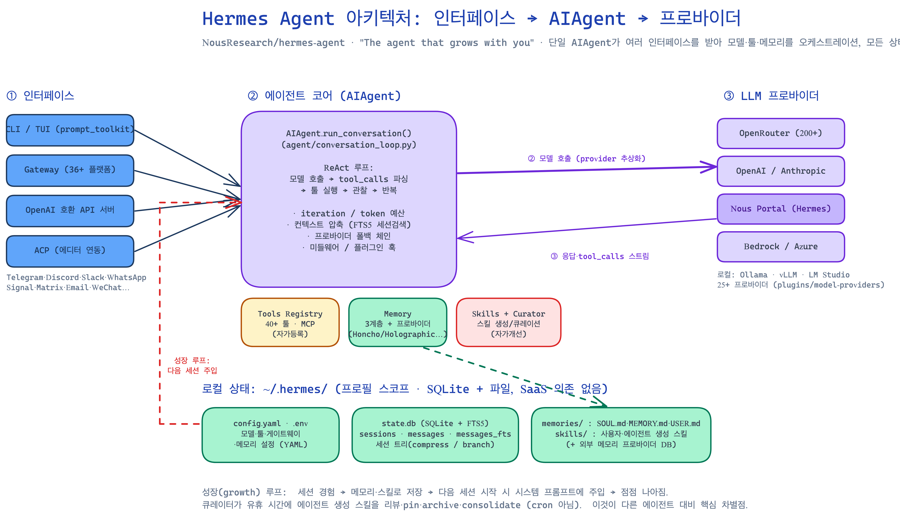
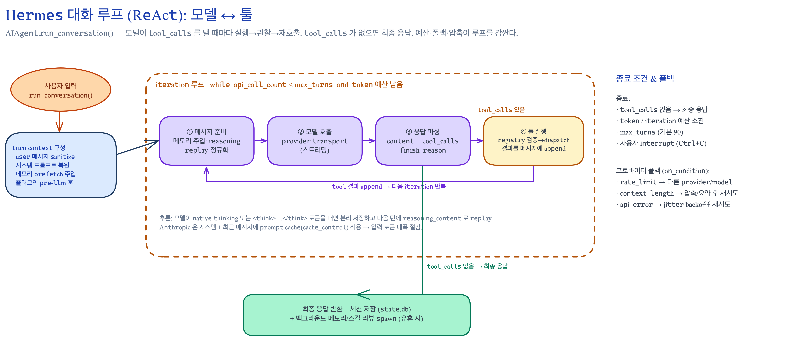
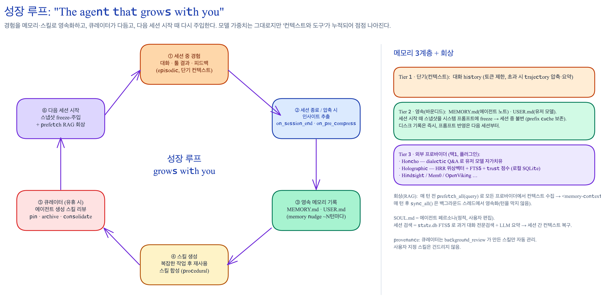

# Hermes Agent 동작 방식·원리·구조 분석

> 대상: **NousResearch/hermes-agent** — *"The agent that grows with you"* (Python).
> 방법: 로컬 클론(main HEAD `202e318c`) 직접 분석 + 공개 자료 교차검증(`/deep-research`, 25개 주장 검증 → 22개 confirm, 3개 기각).
> 코드 링크는 `hermes-agent@202e318c`에 고정. 클릭하면 해당 파일로 이동한다.
> 같은 디렉터리의 [OpenClaw 분석](../openclaw-study/openclaw-architecture.md)과 짝을 이루는 비교 자료다(§9).

---

## 1. Hermes Agent란 무엇인가 — 무슨 문제를 푸는가

**Hermes Agent는 Nous Research가 만든 "스스로 개선되는(self-improving) AI 에이전트"다.** 내 인프라(노트북·VPS·Docker·GPU)에서 돌리고, 이미 쓰는 메신저로 부른다. OpenClaw와 같은 "로컬‑퍼스트 개인 에이전트" 계열이지만, **핵심 차별점은 "성장(growth)"** — 경험에서 스킬을 만들고, 사용 중에 개선하고, 과거 대화를 검색하며, 세션을 넘어 사용자 모델을 깊게 쌓는다.

- README 요지: *경험으로 스킬을 만들고(skill creation), 사용 중 개선하고, 지식을 영속화하도록 스스로를 nudge하고, 과거 대화를 검색하고, 세션 간 사용자 모델을 쌓는 — 내장 학습 루프(built-in learning loop)를 가진 유일한 에이전트.* ([`README.md`](https://github.com/NousResearch/hermes-agent/blob/202e318cb1173a3d2e9d256d251d2062b65e9062/README.md))

**해결하는 문제:**
1. **SaaS 종속 없는 개인 에이전트** — 본인 인프라에서 실행, 모델 200+개(OpenRouter·Nous Portal·OpenAI·Anthropic 등) 자유 선택.
2. **다중 메신저 통합** — Telegram·Discord·Slack·WhatsApp·Signal·Matrix·Email 등 36+ 플랫폼을 하나의 대화 상태로.
3. **세션을 넘는 학습** — 메모리·스킬을 누적해 점점 나아짐(모델 가중치는 그대로, **컨텍스트·도구가 성장**).

### 리포지토리 한눈에

Python 패키지 `hermes-agent` (Python `>=3.11,<3.14`, MIT). 콘솔 진입점:

| 명령 | 진입점 | 역할 |
|------|--------|------|
| `hermes` | [`hermes_cli/main.py`](https://github.com/NousResearch/hermes-agent/blob/202e318cb1173a3d2e9d256d251d2062b65e9062/hermes_cli/main.py) `:main` | 대화형 CLI/TUI |
| `hermes-agent` | [`run_agent.py`](https://github.com/NousResearch/hermes-agent/blob/202e318cb1173a3d2e9d256d251d2062b65e9062/run_agent.py) `:main` | AIAgent 직접 실행 |
| `hermes-acp` | [`acp_adapter/entry.py`](https://github.com/NousResearch/hermes-agent/blob/202e318cb1173a3d2e9d256d251d2062b65e9062/acp_adapter/entry.py) `:main` | 에디터 연동(ACP) |

주요 디렉터리:

| 경로 | 역할 |
|------|------|
| [`agent/`](https://github.com/NousResearch/hermes-agent/tree/202e318cb1173a3d2e9d256d251d2062b65e9062/agent) | 에이전트 런타임 — 대화 루프·프로바이더 추상화·메모리·압축·큐레이터 |
| [`tools/`](https://github.com/NousResearch/hermes-agent/tree/202e318cb1173a3d2e9d256d251d2062b65e9062/tools) | 70+ 툴(레지스트리 자가등록), 스킬·메모리·브라우저·터미널·승인 |
| [`gateway/`](https://github.com/NousResearch/hermes-agent/tree/202e318cb1173a3d2e9d256d251d2062b65e9062/gateway) | 메신저 게이트웨이(FastAPI) + 36+ 플랫폼 어댑터 |
| [`plugins/model-providers/`](https://github.com/NousResearch/hermes-agent/tree/202e318cb1173a3d2e9d256d251d2062b65e9062/plugins/model-providers) | 25+ 프로바이더 플러그인 |
| [`plugins/memory/`](https://github.com/NousResearch/hermes-agent/tree/202e318cb1173a3d2e9d256d251d2062b65e9062/plugins/memory) | 외부 메모리 프로바이더(Honcho·Holographic·Hindsight…) |
| [`skills/`](https://github.com/NousResearch/hermes-agent/tree/202e318cb1173a3d2e9d256d251d2062b65e9062/skills) | 번들 스킬 라이브러리(20+ 카테고리) |
| [`hermes_cli/`](https://github.com/NousResearch/hermes-agent/tree/202e318cb1173a3d2e9d256d251d2062b65e9062/hermes_cli) | TUI·설정·인증·슬래시 커맨드 |
| [`cron/`](https://github.com/NousResearch/hermes-agent/tree/202e318cb1173a3d2e9d256d251d2062b65e9062/cron) | croniter 스케줄러 |

> 의존성은 **정확 핀(exact-pin)** + **lazy 설치**([`tools/lazy_deps.py`](https://github.com/NousResearch/hermes-agent/blob/202e318cb1173a3d2e9d256d251d2062b65e9062/tools/lazy_deps.py)): 코어(openai·pydantic·httpx·fastapi…)만 즉시 설치하고 anthropic·exa·voice·honcho 등 백엔드는 첫 사용 시 로드 → 공급망(supply-chain) 사고로부터 신규 설치 보호.

---

## 2. 전체 아키텍처 — 인터페이스 → AIAgent → 프로바이더

핵심은 **단일 `AIAgent`가 여러 인터페이스를 받아 모델·툴·메모리를 오케스트레이션**하고, 모든 상태를 로컬 `~/.hermes/`에 저장한다는 것이다.



- **인터페이스(좌):** CLI/TUI(prompt_toolkit) · Gateway(36+ 플랫폼) · OpenAI 호환 API 서버([`gateway/platforms/api_server.py`](https://github.com/NousResearch/hermes-agent/blob/202e318cb1173a3d2e9d256d251d2062b65e9062/gateway/platforms/api_server.py)) · ACP. 모두 같은 `AIAgent`로 수렴.
- **에이전트 코어(중앙):** [`AIAgent.run_conversation()`](https://github.com/NousResearch/hermes-agent/blob/202e318cb1173a3d2e9d256d251d2062b65e9062/agent/conversation_loop.py) — ReAct 루프, 예산/압축/폴백. 주변 서브시스템: Tools Registry · Memory(3계층) · Skills+Curator.
- **프로바이더(우):** OpenRouter(200+)·OpenAI/Anthropic·Nous Portal·Bedrock/Azure·로컬(Ollama·vLLM·LM Studio). 25+ 플러그인.
- **저장(하단):** `~/.hermes/` — `config.yaml`·`state.db`(SQLite+FTS5)·`memories/`·`skills/`. SaaS 의존 없음.

> **성장 루프(빨간 점선):** 세션 경험 → 메모리·스킬로 저장 → 다음 세션 시작 때 주입 → 점점 나아짐. 이것이 §6의 핵심.

---

## 3. 대화 루프 (ReAct): 모델 ↔ 툴

데이터 흐름(공개 아키텍처 문서 + 코드 일치):

```
사용자 입력
  → HermesCLI.process_input()
  → AIAgent.run_conversation()        # agent/conversation_loop.py
      → build_system_prompt()          # 세션당 1회 캐시
      → resolve_runtime_provider()     # (provider, model) → (api_mode, api_key, base_url)
      → [루프] API 호출 → 응답 파싱
            → tool_calls 있으면 handle_function_call() → 결과 append → 루프
            → 없으면 최종 응답
  → SessionDB 저장 (hermes_state.py)
```



### 루프 한 바퀴 (turn)

1. **메시지 준비** — user 메시지 sanitize, 시스템 프롬프트 복원(캐시), **메모리 prefetch 주입**, reasoning replay, 정규화. 컨텍스트가 50%를 넘으면 **preflight 압축**.
2. **모델 호출** — provider transport로 라우팅, 기본 **스트리밍**(stale-stream 헬스체크).
3. **응답 파싱** — `content` + `tool_calls` + `finish_reason`(stop/length/tool_calls). truncation 감지·재시도.
4. **툴 실행** — 핸들러를 [`tools/registry.py`](https://github.com/NousResearch/hermes-agent/blob/202e318cb1173a3d2e9d256d251d2062b65e9062/tools/registry.py)에서 해석. **단일 호출은 메인 스레드, 복수 호출은 `ThreadPoolExecutor`로 동시 실행**. 결과를 메시지에 append → 다음 iteration.
   - **에이전트 레벨 툴**(`todo`·`memory`·`session_search`·`delegate_task`)은 레지스트리 디스패치 *이전에* 가로채 처리.
5. tool_calls가 없으면 → **최종 응답** 반환 + 세션 저장([`hermes_state.py`](https://github.com/NousResearch/hermes-agent/blob/202e318cb1173a3d2e9d256d251d2062b65e9062/hermes_state.py)) + **유휴 시 백그라운드 메모리/스킬 리뷰 spawn**([`agent/background_review.py`](https://github.com/NousResearch/hermes-agent/blob/202e318cb1173a3d2e9d256d251d2062b65e9062/agent/background_review.py)).

**종료 조건:** tool_calls 없음(최종) · token/iteration 예산 소진 · `max_turns`(기본 90) · 사용자 interrupt(Ctrl+C).
**구현:** [`agent/conversation_loop.py`](https://github.com/NousResearch/hermes-agent/blob/202e318cb1173a3d2e9d256d251d2062b65e9062/agent/conversation_loop.py)(루프), [`agent/tool_executor.py`](https://github.com/NousResearch/hermes-agent/blob/202e318cb1173a3d2e9d256d251d2062b65e9062/agent/tool_executor.py)(디스패치), [`agent/turn_context.py`](https://github.com/NousResearch/hermes-agent/blob/202e318cb1173a3d2e9d256d251d2062b65e9062/agent/turn_context.py)(턴 준비).

---

## 4. 툴 시스템 & 함수 호출 포맷 — 두 개의 레이어

### 4.1 툴 레지스트리 (자가등록)

각 툴 파일이 import 시점에 [`tools/registry.py`](https://github.com/NousResearch/hermes-agent/blob/202e318cb1173a3d2e9d256d251d2062b65e9062/tools/registry.py)의 `registry.register(...)`를 호출해 스스로 등록한다. **70+ 툴 / ~28 toolset**(문서 기준; 로컬에서 40+ 직접 확인). 등록 항목: `name`·`toolset`·`schema`(JSON Schema)·`handler`·`check_fn`(가용성)·`emoji`·`max_result_size_chars`·`dynamic_schema_overrides`.

```python
# tools/<my>_tool.py — 새 툴 추가는 파일 하나로 끝, 다른 파일 수정 불필요
registry.register(name="terminal", toolset="terminal", schema=TERMINAL_SCHEMA,
                  handler=_handle_terminal, check_fn=check_terminal_requirements, emoji="💻")
```

대표 툴: 웹검색·터미널·파일·패치·브라우저(CDP, [`tools/browser_tool.py`](https://github.com/NousResearch/hermes-agent/blob/202e318cb1173a3d2e9d256d251d2062b65e9062/tools/browser_tool.py))·코드실행·이미지/비전·`skill_manage`·`memory`·`session_search`·`delegate_task`·`cronjob`·Home Assistant·computer_use·Kanban·MCP. **터미널 백엔드 6종**: local·Docker·SSH·Daytona·Modal·Singularity([`tools/terminal_tool.py`](https://github.com/NousResearch/hermes-agent/blob/202e318cb1173a3d2e9d256d251d2062b65e9062/tools/terminal_tool.py)).

**안전:** 위험 명령 정규식 감지 + 승인 게이트([`tools/approval.py`](https://github.com/NousResearch/hermes-agent/blob/202e318cb1173a3d2e9d256d251d2062b65e9062/tools/approval.py); CLI 대화형 / Gateway 비동기 큐 / cron 비대화형), allowlist, `HERMES_YOLO_MODE`(import 시 freeze로 prompt injection 방지). 경로 검증, subprocess 격리. MCP 서버 연동([`tools/mcp_tool.py`](https://github.com/NousResearch/hermes-agent/blob/202e318cb1173a3d2e9d256d251d2062b65e9062/tools/mcp_tool.py))은 같은 레지스트리에 동적 등록.

### 4.2 두 개의 함수 호출 포맷 — API 레이어 vs Hermes 트레이젝토리 포맷 ⭐

여기가 핵심 포인트다. **두 표현이 레이어별로 공존한다:**

**(A) API/런타임 레이어 — provider 네이티브 `tool_calls`.** 여러 `api_mode`(`chat_completions`·`anthropic_messages`·`codex_responses`·bedrock 등)가 **하나의 내부 OpenAI 스타일 메시지 포맷**(`role`/`content`/`tool_calls` dict)으로 수렴한다. 모델이 낸 `tool_calls` 배열을 파싱·실행하고, 결과를 `{"role":"tool", ...}`로 되돌린다. (§3의 루프가 이 레이어)

**(B) Hermes 트레이젝토리/학습 포맷 — XML 태그.** 저장·로깅·그리고 **Nous Hermes 모델 자체**가 학습된 포맷은 XML 태그 기반이다:

```text
# 시스템 프롬프트: 가용 함수 시그니처를 <tools>…</tools> 로 제공
You are a function calling AI model. You are provided with function signatures within <tools></tools> XML tags.

# 추론은 <think> 로 정규화 (네이티브 thinking 토큰을 감쌈; 빈 블록도 항상 포함)
<think>
…reasoning…
</think>

# 툴 호출은 <tool_call> 안에 JSON
<tool_call>{"name": "terminal", "arguments": {"command": "ls"}}</tool_call>

# 툴 응답은 <tool_response> 로
<tool_response>{"tool_call_id": "call_abc123", "name": "terminal", "content": "output"}</tool_response>
```

즉, **런타임 디스패치는 OpenAI식 `tool_calls`로 하되, 트레이젝토리(저장/학습 데이터)는 `<tool_call>`/`<think>`/`<tool_response>` XML로 정규화**한다. 이 XML 포맷은 Nous의 [Hermes-Function-Calling](https://github.com/NousResearch/Hermes-Function-Calling) 및 [hermes-function-calling-v1 데이터셋](https://huggingface.co/datasets/NousResearch/hermes-function-calling-v1)에서 정의된 것으로, **모델·도구·트레이닝이 한 포맷으로 정렬**되는 게 Hermes 계열의 특징이다.

> 참고: 별도 참조 구현인 `Hermes-Function-Calling`의 재귀 루프는 `max_depth` 기본 **5**이지만, 이는 hermes-agent 런타임의 `max_turns`(기본 90)와는 다른 컴포넌트다.

---

## 5. LLM 프로바이더 라우팅

**공유 런타임 리졸버**가 CLI·gateway·cron·ACP·보조(aux) 호출 전부에서 쓰인다. `(provider, model)` 튜플을 `(api_mode, api_key, base_url)`로 매핑하고, OAuth 플로우·credential pool·alias 해석을 처리한다.

- **api_mode(3 주축):** `chat_completions`(OpenAI 호환) · `anthropic_messages`(네이티브 Anthropic) · `codex_responses`(OpenAI Codex). 모두 내부 OpenAI식 포맷으로 수렴.
- **18+ 프로바이더** — 선언적 `ProviderProfile`([`providers/base.py`](https://github.com/NousResearch/hermes-agent/blob/202e318cb1173a3d2e9d256d251d2062b65e9062/providers/base.py))로 한 번 선언, 모든 하위 레이어가 프로필에서 읽음. 플러그인은 [`plugins/model-providers/<name>/`](https://github.com/NousResearch/hermes-agent/tree/202e318cb1173a3d2e9d256d251d2062b65e9062/plugins/model-providers)에서 `register_provider(profile)`. 사용자 디렉터리 오버라이드 가능.
- **폴백 체인(`fallback_providers`)** — `on_condition`별: `rate_limit` → 다른 provider, `context_length` → 압축/요약 후, `api_error` → jitter backoff.
- **Nous Hermes 모델** — Nous Portal(OAuth) 또는 OpenRouter 카탈로그로 접근. 별도 런타임 분기 없이 동일 프로필 시스템.
- Anthropic prompt cache(`cache_control`)를 시스템 + 최근 메시지에 적용해 입력 토큰 절감([`agent/chat_completion_helpers.py`](https://github.com/NousResearch/hermes-agent/blob/202e318cb1173a3d2e9d256d251d2062b65e9062/agent/chat_completion_helpers.py)).

---

## 6. 메모리 & "성장(growth)" 시스템 — 핵심 차별점



### 6.1 메모리 3계층

| 계층 | 내용 | 비고 |
|------|------|------|
| **Tier 1 단기** | 대화 history(토큰 제한) | 초과 시 **trajectory 압축·요약**([`trajectory_compressor.py`](https://github.com/NousResearch/hermes-agent/blob/202e318cb1173a3d2e9d256d251d2062b65e9062/trajectory_compressor.py), [`agent/context_compressor.py`](https://github.com/NousResearch/hermes-agent/blob/202e318cb1173a3d2e9d256d251d2062b65e9062/agent/context_compressor.py)) |
| **Tier 2 영속(바운디드)** | `MEMORY.md`(에이전트 노트) · `USER.md`(유저 모델) | 세션 시작 때 **스냅샷을 시스템 프롬프트에 freeze** → 세션 중 불변(prefix cache 보존). 디스크 기록은 즉시, 프롬프트 반영은 다음 세션부터. **항상 활성.** |
| **Tier 3 외부 프로바이더(택1)** | Honcho · Holographic · Hindsight · Mem0 · OpenViking · RetainDB · ByteRover · Supermemory · Memori | **동시에 하나만** 활성. 플러그인([`plugins/memory/`](https://github.com/NousResearch/hermes-agent/tree/202e318cb1173a3d2e9d256d251d2062b65e9062/plugins/memory)) |

- `SOUL.md` = 에이전트 **페르소나**(정적, 사용자 편집).
- 내장 메모리 툴([`tools/memory_tool.py`](https://github.com/NousResearch/hermes-agent/blob/202e318cb1173a3d2e9d256d251d2062b65e9062/tools/memory_tool.py)): `add`/`replace`/`remove`/`read`, 원자적 쓰기·파일락·문자수 예산·주입탐지 스캔.

### 6.2 회상(RAG) & 동기화 워크플로

오케스트레이터 [`agent/memory_manager.py`](https://github.com/NousResearch/hermes-agent/blob/202e318cb1173a3d2e9d256d251d2062b65e9062/agent/memory_manager.py) ([`agent/memory_provider.py`](https://github.com/NousResearch/hermes-agent/blob/202e318cb1173a3d2e9d256d251d2062b65e9062/agent/memory_provider.py) ABC):

- **매 턴 전** `prefetch_all(query)` — 모든 프로바이더에서 관련 기억 수집(백그라운드·논블로킹) → `<memory-context>` 펜스로 감싸 주입.
- **매 턴 후** `sync_all()` — 턴을 영속화(백그라운드 스레드, 턴을 막지 않음).
- **세션 종료** `on_session_end()` / **압축 직전** `on_pre_compress()` — 사라지기 전에 인사이트 추출.
- **세션 검색** `session_search` — `state.db` FTS5로 과거 대화 전문검색 + LLM 요약 → 세션 간 컨텍스트 복구.
- **임베딩**은 공유 프로토콜 모듈(`embed_text()`/`embed_texts()`/`dimensions`)로 추상화(메모리 회상·시맨틱 코드검색 공용). *구체 임베딩 모델·차원은 자료마다 엇갈려 본 문서에서 단정하지 않음.*

대표 외부 프로바이더 특성:
- **Holographic** — HRR(위상벡터) + FTS5 + **trust 점수**(검색·피드백으로 갱신; 비대칭 +0.05/−0.10*) 로컬 SQLite([`plugins/memory/holographic/`](https://github.com/NousResearch/hermes-agent/tree/202e318cb1173a3d2e9d256d251d2062b65e9062/plugins/memory/holographic)).
- **Honcho** — dialectic Q&A로 유저 모델 자가치유.
- **Hindsight** — 지식그래프 + reflect 합성, observation 통합.

### 6.3 스킬(절차적 기억) + 큐레이터

- **스킬 생성** — 복잡한 작업 후 재사용 가능한 스킬(SKILL.md: YAML frontmatter + 본문)을 합성([`tools/skill_manager_tool.py`](https://github.com/NousResearch/hermes-agent/blob/202e318cb1173a3d2e9d256d251d2062b65e9062/tools/skill_manager_tool.py)).
- **큐레이터** — 유휴 시간에(블로킹 없이) 에이전트 생성 스킬을 리뷰해 **pin/archive/consolidate**([`agent/curator.py`](https://github.com/NousResearch/hermes-agent/blob/202e318cb1173a3d2e9d256d251d2062b65e9062/agent/curator.py)). cron이 아니라 비활동 트리거.
- **provenance 가드** — 큐레이터는 `background_review`가 만든 스킬만 자동 관리하고, **사용자 지정 스킬은 건드리지 않는다**([`tools/skill_provenance.py`](https://github.com/NousResearch/hermes-agent/blob/202e318cb1173a3d2e9d256d251d2062b65e9062/tools/skill_provenance.py), [`tools/skill_usage.py`](https://github.com/NousResearch/hermes-agent/blob/202e318cb1173a3d2e9d256d251d2062b65e9062/tools/skill_usage.py)).

### 6.4 더 위의 자가진화 — DSPy + GEPA (별도 컴패니언 레포)

본체의 메모리·스킬 루프 위에, Nous는 **자가개선 시스템**을 별도 레포 [`NousResearch/hermes-agent-self-evolution`](https://github.com/NousResearch/hermes-agent-self-evolution)로 둔다:

- **DSPy + GEPA**(Genetic‑Pareto Prompt Evolution)로 **스킬·프롬프트·툴 설명·코드**를 진화적 탐색으로 최적화.
- **GPU 학습이 아니라 API 호출만**(~$2–10/run)으로 변형 생성·평가.
- 무작위 변이가 아니라 **실행 트레이스를 읽어 "왜" 실패하는지 진단** → 표적 변이 제안(reflective evolutionary loop).

> 정리하면 "성장"은 3층이다: ① 영속 메모리(MEMORY/USER + 프로바이더) ② 스킬 생성·큐레이션 ③ GEPA 프롬프트/스킬 진화. **모델 가중치는 그대로**, 컨텍스트·도구·프롬프트가 누적·정제되어 나아진다.

---

## 7. 상태 / 스토리지 & 설정

### 상태 (SQLite + 파일)
- [`hermes_state.py`](https://github.com/NousResearch/hermes-agent/blob/202e318cb1173a3d2e9d256d251d2062b65e9062/hermes_state.py): `~/.hermes/state.db`(SQLite, **WAL** + NFS면 `DELETE` 폴백). 테이블 `sessions`·`messages`·**`messages_fts`(FTS5)**. **세션 트리** — `/compress`는 `end_reason='compression'`로 부모를 닫고 새 세션을 자식으로, `/branch`는 분기. `/resume`로 재개.
- 메모리/스킬은 파일(`memories/`·`skills/`)로 + 외부 프로바이더 DB.

### 설정 ([`hermes_cli/config.py`](https://github.com/NousResearch/hermes-agent/blob/202e318cb1173a3d2e9d256d251d2062b65e9062/hermes_cli/config.py))
- `~/.hermes/config.yaml`(YAML) + `~/.hermes/.env`(시크릿). `${VAR}` 치환.
- 로딩: `(path, mtime, size)` 캐시 → `DEFAULT_CONFIG`에 deep-merge → 파싱 실패 시 `.corrupt.<ts>.bak` 백업 후 기본값. RLock 직렬화(libyaml 비스레드세이프).
- 프로필 스코프(`HERMES_HOME` 기본 `~/.hermes`). 주요 키: `model`·`providers`·`fallback_providers`·`toolsets`·`agent.max_turns`·`terminal.backend`·`memory`·`mcp_servers`·`approvals`.

---

## 8. 인터페이스 & 운영

- **CLI/TUI** (`hermes`): prompt_toolkit 멀티라인 편집, 슬래시 커맨드(`/model`·`/compress`·`/skills`·`/memory`·`/branch`·`/resume`), interrupt-and-redirect(Ctrl+C).
- **Gateway** (`hermes gateway start`): FastAPI 단일 프로세스가 36+ 플랫폼 연결, 메시지별 세션 라우팅(`chat_id`/`user_id`/`platform`), ThreadPoolExecutor 동시 실행, DM 페어링·승인.
- **OpenAI 호환 API 서버**: `/v1/chat/completions`로 외부 클라이언트가 Hermes를 모델처럼 호출(툴 루프 통합).
- **Cron** ([`cron/scheduler.py`](https://github.com/NousResearch/hermes-agent/blob/202e318cb1173a3d2e9d256d251d2062b65e9062/cron/scheduler.py)): croniter 데몬, 자연어/Python 작업을 플랫폼으로 배달.

---

## 9. OpenClaw와의 비교 — 무엇이 같고 무엇이 다른가

두 프로젝트는 같은 "로컬‑퍼스트 다채널 개인 에이전트" 계열로, 생태계에서 서로 peer로 자주 언급된다. 공통점이 많지만 강조점이 다르다.

| 축 | **Hermes Agent** | **OpenClaw** |
|----|------------------|--------------|
| 언어/런타임 | Python | TypeScript/Node |
| 게이트웨이 | FastAPI, 36+ 플랫폼 어댑터 | **WS 게이트웨이 프로토콜**(control plane + node 전송, `connect` 핸드셰이크) |
| 확장 모델 | 툴 레지스트리 자가등록 + 프로바이더/메모리 플러그인 | **plugin-agnostic core** + `openclaw/plugin-sdk/*` 배럴, manifest 선검사 4레이어 |
| 함수호출 포맷 | API는 `tool_calls`, **트레이젝토리는 `<tool_call>`/`<think>` XML**(모델·학습과 정렬) | 프로바이더 네이티브 `tool_calls` |
| 상태 | `state.db` SQLite+FTS5(세션 트리) | `state/openclaw.sqlite` + 에이전트별 DB(Kysely) |
| **차별점** | **"성장": 메모리 + 스킬 생성/큐레이터 + GEPA 자가진화**, Nous Hermes 모델/포맷 정렬 | 게이트웨이 프로토콜·노드·엄격한 코어/플러그인 경계 규율 |

**한 줄 요약:** OpenClaw가 *"여러 채널을 잇는 control‑plane 게이트웨이"*에 무게를 둔다면, Hermes는 *"세션을 넘어 학습·진화하는 에이전트(성장 루프)"*에 무게를 둔다.

---

## 부록 A. 핵심 파일 지도

> 모든 파일은 `hermes-agent@202e318c` 기준 클릭 링크.

| 관심사 | 파일 |
|--------|------|
| 에이전트 오케스트레이터 | [`run_agent.py`](https://github.com/NousResearch/hermes-agent/blob/202e318cb1173a3d2e9d256d251d2062b65e9062/run_agent.py), [`agent/conversation_loop.py`](https://github.com/NousResearch/hermes-agent/blob/202e318cb1173a3d2e9d256d251d2062b65e9062/agent/conversation_loop.py), [`agent/turn_context.py`](https://github.com/NousResearch/hermes-agent/blob/202e318cb1173a3d2e9d256d251d2062b65e9062/agent/turn_context.py) |
| 프로바이더/모델 | [`agent/chat_completion_helpers.py`](https://github.com/NousResearch/hermes-agent/blob/202e318cb1173a3d2e9d256d251d2062b65e9062/agent/chat_completion_helpers.py), [`providers/base.py`](https://github.com/NousResearch/hermes-agent/blob/202e318cb1173a3d2e9d256d251d2062b65e9062/providers/base.py), [`plugins/model-providers/`](https://github.com/NousResearch/hermes-agent/tree/202e318cb1173a3d2e9d256d251d2062b65e9062/plugins/model-providers) |
| 툴 | [`tools/registry.py`](https://github.com/NousResearch/hermes-agent/blob/202e318cb1173a3d2e9d256d251d2062b65e9062/tools/registry.py), [`agent/tool_executor.py`](https://github.com/NousResearch/hermes-agent/blob/202e318cb1173a3d2e9d256d251d2062b65e9062/agent/tool_executor.py), [`toolsets.py`](https://github.com/NousResearch/hermes-agent/blob/202e318cb1173a3d2e9d256d251d2062b65e9062/toolsets.py), [`tools/approval.py`](https://github.com/NousResearch/hermes-agent/blob/202e318cb1173a3d2e9d256d251d2062b65e9062/tools/approval.py), [`tools/mcp_tool.py`](https://github.com/NousResearch/hermes-agent/blob/202e318cb1173a3d2e9d256d251d2062b65e9062/tools/mcp_tool.py) |
| 메모리 | [`agent/memory_manager.py`](https://github.com/NousResearch/hermes-agent/blob/202e318cb1173a3d2e9d256d251d2062b65e9062/agent/memory_manager.py), [`agent/memory_provider.py`](https://github.com/NousResearch/hermes-agent/blob/202e318cb1173a3d2e9d256d251d2062b65e9062/agent/memory_provider.py), [`tools/memory_tool.py`](https://github.com/NousResearch/hermes-agent/blob/202e318cb1173a3d2e9d256d251d2062b65e9062/tools/memory_tool.py), [`plugins/memory/holographic/`](https://github.com/NousResearch/hermes-agent/tree/202e318cb1173a3d2e9d256d251d2062b65e9062/plugins/memory/holographic) |
| 스킬/큐레이터 | [`tools/skill_manager_tool.py`](https://github.com/NousResearch/hermes-agent/blob/202e318cb1173a3d2e9d256d251d2062b65e9062/tools/skill_manager_tool.py), [`agent/curator.py`](https://github.com/NousResearch/hermes-agent/blob/202e318cb1173a3d2e9d256d251d2062b65e9062/agent/curator.py), [`agent/background_review.py`](https://github.com/NousResearch/hermes-agent/blob/202e318cb1173a3d2e9d256d251d2062b65e9062/agent/background_review.py), [`tools/skill_provenance.py`](https://github.com/NousResearch/hermes-agent/blob/202e318cb1173a3d2e9d256d251d2062b65e9062/tools/skill_provenance.py) |
| 압축 | [`trajectory_compressor.py`](https://github.com/NousResearch/hermes-agent/blob/202e318cb1173a3d2e9d256d251d2062b65e9062/trajectory_compressor.py), [`agent/context_compressor.py`](https://github.com/NousResearch/hermes-agent/blob/202e318cb1173a3d2e9d256d251d2062b65e9062/agent/context_compressor.py) |
| 게이트웨이/CLI | [`gateway/run.py`](https://github.com/NousResearch/hermes-agent/blob/202e318cb1173a3d2e9d256d251d2062b65e9062/gateway/run.py), [`gateway/platforms/`](https://github.com/NousResearch/hermes-agent/tree/202e318cb1173a3d2e9d256d251d2062b65e9062/gateway/platforms), [`hermes_cli/main.py`](https://github.com/NousResearch/hermes-agent/blob/202e318cb1173a3d2e9d256d251d2062b65e9062/hermes_cli/main.py), [`hermes_cli/config.py`](https://github.com/NousResearch/hermes-agent/blob/202e318cb1173a3d2e9d256d251d2062b65e9062/hermes_cli/config.py) |
| 상태/스케줄 | [`hermes_state.py`](https://github.com/NousResearch/hermes-agent/blob/202e318cb1173a3d2e9d256d251d2062b65e9062/hermes_state.py), [`cron/scheduler.py`](https://github.com/NousResearch/hermes-agent/blob/202e318cb1173a3d2e9d256d251d2062b65e9062/cron/scheduler.py) |

## 부록 B. 출처 & 검증 메모

- **1차 코드:** 로컬 클론 main HEAD [`202e318c`](https://github.com/NousResearch/hermes-agent/tree/202e318cb1173a3d2e9d256d251d2062b65e9062) — 위 경로 직접 분석(모든 링크 존재 확인).
- **공개 자료(교차검증, 3‑0 confirm):** [hermes-agent docs](https://hermes-agent.nousresearch.com/docs/) — `developer-guide/architecture`·`developer-guide/agent-loop`·`developer-guide/trajectory-format`·`user-guide/features/memory-providers`; [hermes-agent-self-evolution](https://github.com/NousResearch/hermes-agent-self-evolution); [Hermes-Function-Calling](https://github.com/NousResearch/Hermes-Function-Calling); [hermes-function-calling-v1 dataset](https://huggingface.co/datasets/NousResearch/hermes-function-calling-v1).
- **검증으로 기각(3개, 본문 미반영):** Hermes-Function-Calling이 메모리/성장 없는 무상태 루프라는 주장(0‑3, 그건 함수호출 *참조* 레포일 뿐), 외부 프로바이더 정확 개수 단정(1‑2), 특정 로컬 임베딩 모델 FastEmbed/MiniLM‑384d 단정(1‑2). → `*` 표시한 Holographic trust 수치(+0.05/−0.10)는 2‑1로 약하게 확인됨.
- **레이어 주의:** §4.2의 `<tool_call>` XML은 **트레이젝토리/학습 포맷**이고, 런타임 디스패치는 provider 네이티브 `tool_calls`다. 두 레이어를 혼동하지 말 것.
- 본 문서의 코드 동작 서술은 *로컬 소스 직접 분석*이 1차 근거이며, 공개 문서는 이를 보강·교차검증하는 데 사용했다.
